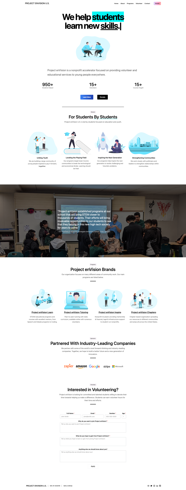

# Project enVision U.S.'s Website


---



This is the current deployment of Project enVision's website located at [https://envisionnew.org/](https://envisionnew.org/).

## About Project enVision U.S.

Project enVision is a 501(c)(3) non-profit organization dedicated to the community. By creating relationships with students, schools, and local politicians, through different programs, we envision a community where learning is _free_ and _accessible_. Our mission is to build a connected community by facilitating learning, while targetting accessibility and bonding. Our volunteers are commited to this mission and strengthening our community, together.

## Reproduction

Clone/run the development server:

```bash
$ git clone https://github.com/envisionnew/envisionnew.org.git
$ cd envisionnew.org
$ yarn
# or
$ npm install
$ yarn dev
# or
$ npm run dev
```

Open [http://localhost:3000](http://localhost:3000) with your browser to see the deployment.

You can start editing the page by modifying `pages/index.js`. The page auto-updates as you edit the file.

## Links & Contact

Project Link – [https://envisionnew.org/](https://envisionnew.org/)

Project GitHub – [https://github.com/envisionnew/envisionnew.org/](https://github.com/envisionnew/envisionnew.org/)

Nine4 - [nine4.app](https://nine4.app/)

Contact - [info@envisionnew.org](mailto:info@envisionnew.org)

## Contributions

Contributions are welcome! Please open a PR/Issue if you have any edits/suggestions for changes.

---

<a href="http://vercel.com/?utm_source=envisionnew&utm_campaign=oss" align="center">
  <p href="" align="center">
    
  </p>
</a>
