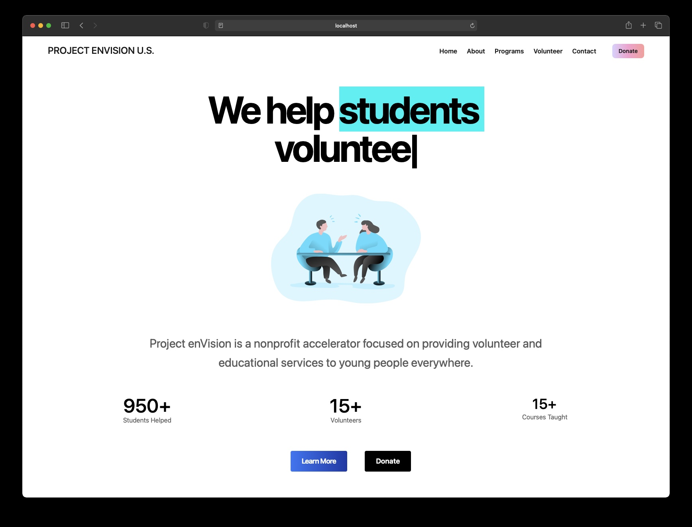

# Ataraxia HomePage



This is the current deployment of Ataraxia's webpage located at [https://ataraxia.envisionnew.org/](https://ataraxia.envisionnew.org/).

## Getting Started

First, clone/run the development server:

```bash
$ git clone https://github.com/minor/ataraxiaweb.git
$ cd web
$ yarn
# or
$ npm install
$ yarn dev
# or
$ npm run dev
```

Open [http://localhost:3000](http://localhost:3000) with your browser to see the result.

You can start editing the page by modifying `pages/index.js`. The page auto-updates as you edit the file.

[API routes](https://nextjs.org/docs/api-routes/introduction) can be accessed on [http://localhost:3000/api/hello](http://localhost:3000/api/hello). This endpoint can be edited in `pages/api/hello.js`.

The `pages/api` directory is mapped to `/api/*`. Files in this directory are treated as [API routes](https://nextjs.org/docs/api-routes/introduction) instead of React pages.

## Links & Contact

Project Link – [https://ataraxia.envisionnew.org/](https://ataraxia.envisionnew.org/)

Project GitHub – [https://github.com/minor/ataraxiaweb/](https://github.com/minor/ataraxiaweb/)

Template Link – [https://nine4.app](https://nine4.app)
